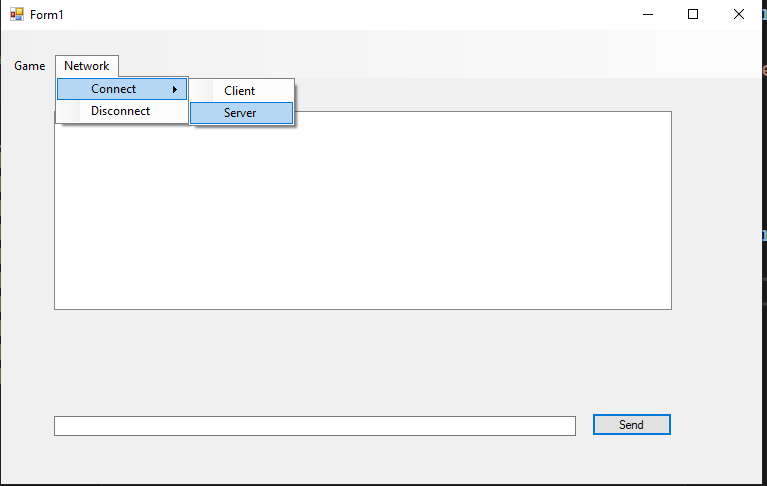
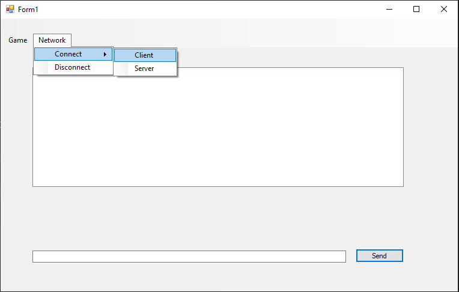
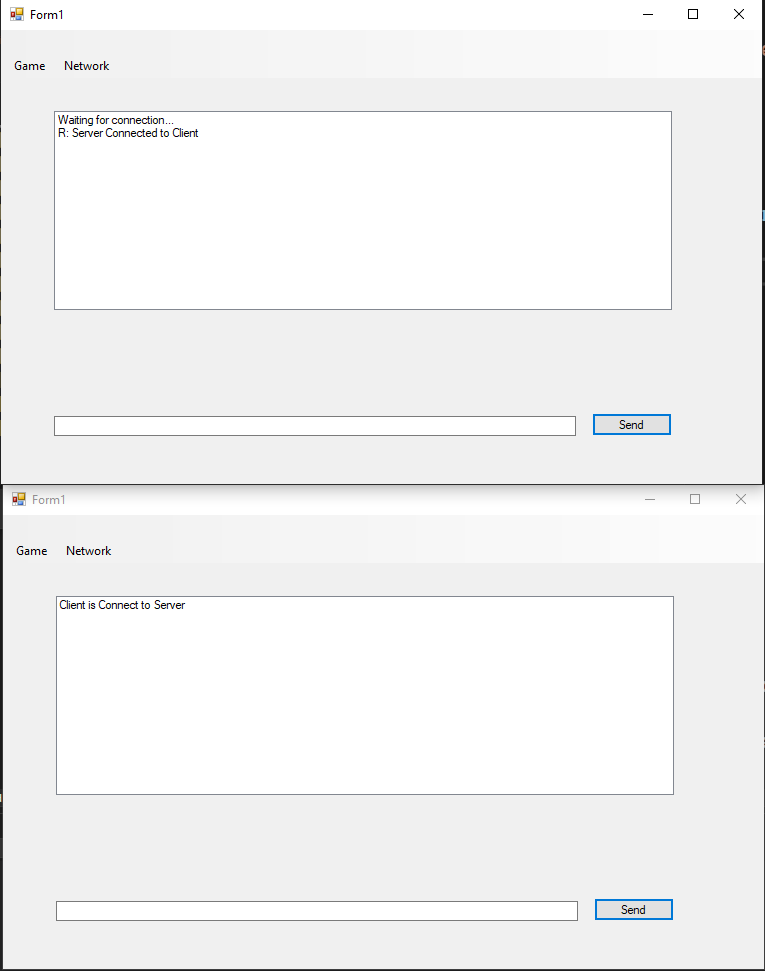

# Chat Application

Client-Server real time messaging application on a local network. App built for educational purposes only.

## Get started

1. Clone the repository
2. Build the solution with .NET framework

## How to use

- Start listening as a **server** on your local computer

- Connect to a server through TCP. You will need the **IP** of the other computer.

- Success message will be shown

